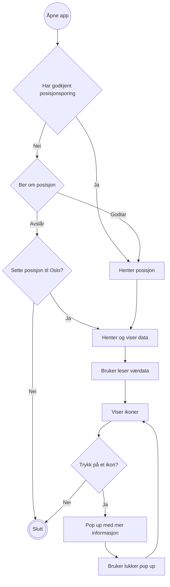
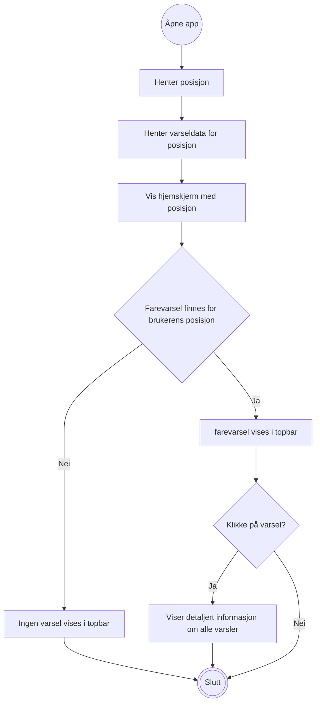
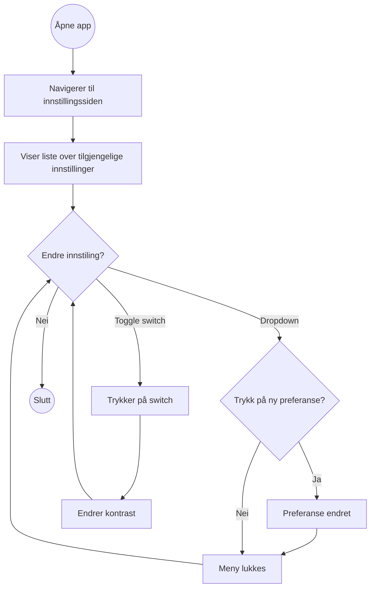
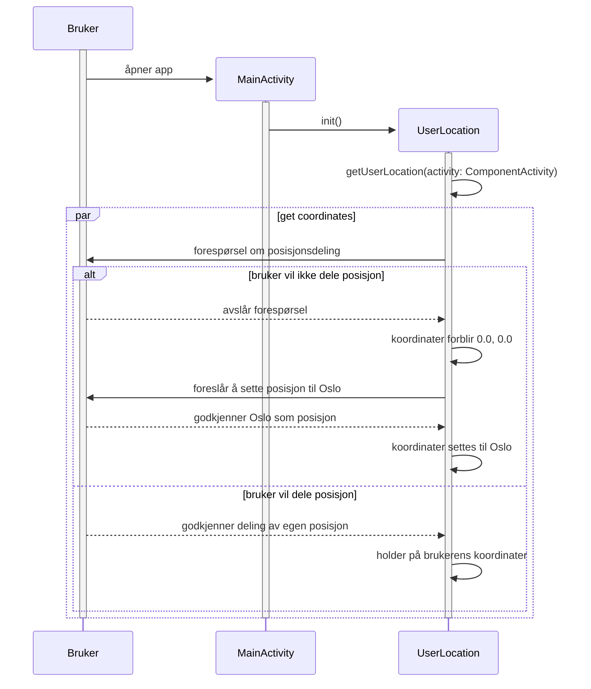
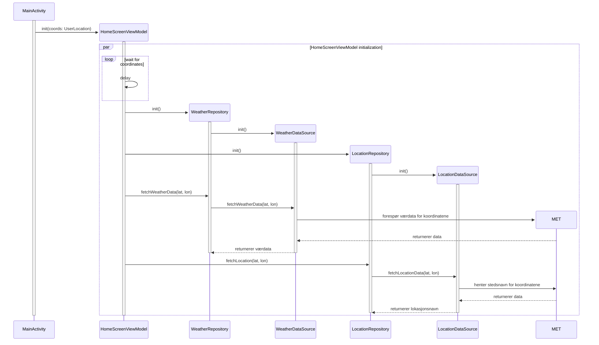
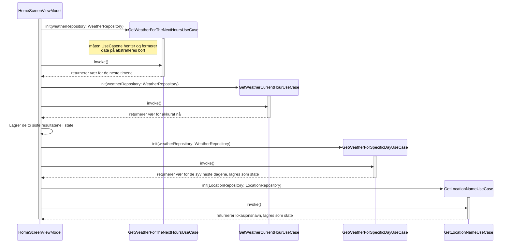
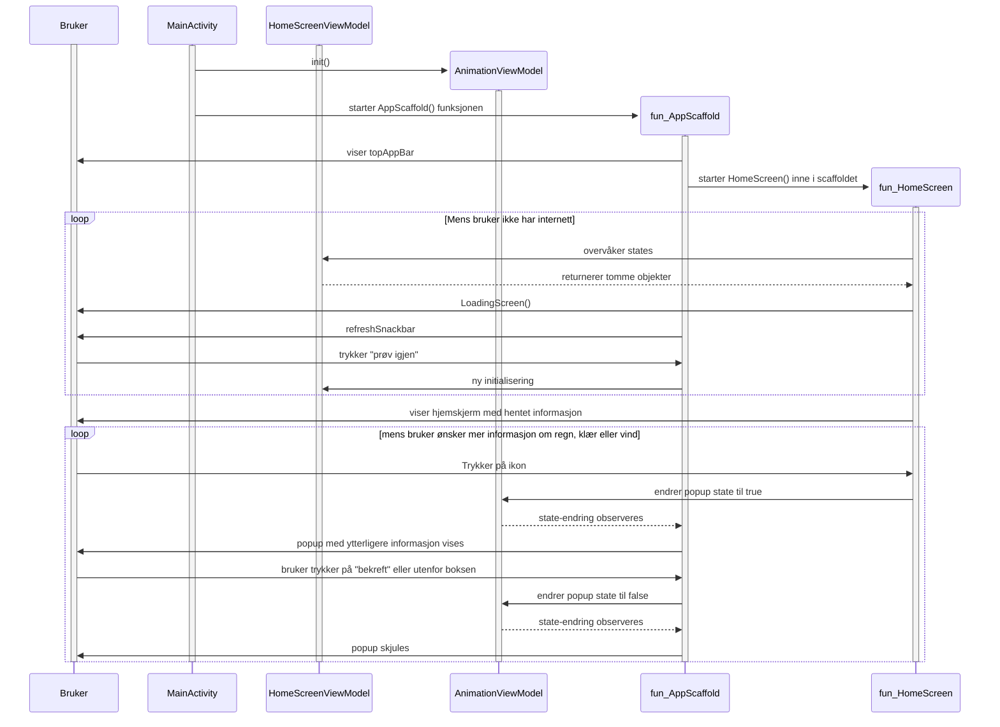

# Modellering

## Klassediagram 
Bruk hvilken som helst Code Editor med "Mermaid" - på lightmode for å kunne se komponentene og skriften i klassediagrammet.

```mermaid

    classDiagram
        
        class fun_HomeScreen {
        }
        
        class HomeScreenViewModel {
            - coords: UserLocation
            - weatherRepository: WeatherRepository
            - locationRepository: LocationRepository
            + weatherUiState: StateFlow&lt;HourlyWeatherUiState>
            + weatherNextDaysUiState: StateFlow&lt;WeekForecastUiState>
            + locationUiState: StateFlow&lt;LocationWeatherUiState>
            + readyUiState: StateFlow&lt;Boolean>
            + showSnackbarState: StateFlow&lt;Boolean>
            + isRefreshingState: StateFlow&lt;Boolean>
            
            + intitalize()
            + refresh()
            + toggleRefreshing(bool : Boolean)
            + showSnackbar()
        }
            
        class HourlyWeatherUiState {
            + nextHours: List&lt;TimeSeriesEntry>
            + weatherNowString: String
            + weatherNowEntry: TimeSeriesEntry#63;
        }
        
        class LocationWeatherUiState {
            + location: String
        }
        class WeekForecastUiState {
            + sevenNextDays: List&lt;List&lt;TimeSeriesEntry>>
        }
        
        class fun_HourlyScreen {
        }
        
        class fun_SettingsScreen {
        }
        class SettingsScreenViewModel {
            -  sharedPref: SharedPreferences
            + selectedTheme: StateFlow&lt;Theme>
            + themeExpanded: StateFlow&lt;Boolean>
            + tempExpanded: StateFlow&lt;Boolean>
            + lightOrDarkExpanded: StateFlow&lt;Boolean>
            + highContrastOn: StateFlow&lt;Boolean>
            + tempPref: StateFlow&lt;Int>
            + lightOrDarkPref: StateFlow&lt;Int>
            + isDarkMode: StateFlow&lt;Boolean>
            
            + correctLightOrDarkMode(bool: Boolean)
            + themeExpandedChange(bool: Boolean)
            + tempExpandedChange(bool: Boolean)
            + lightOrDarkExpandedChange(bool: Boolean)
            + highContrastChange(bool: Boolean)
            + intToTheme(int: Int) Theme
            + intToTemp (int: Int) String
            + intToLightOrDark(int: Int) String
            + switchTheme(int: Int)
            + switchTemp(int: Int)
            + switchLightOrDark(int: Int)
            + saveThemeChoice(int: Int)
            + saveTempChoice(int: Int)
            + saveLightOrDarkChoice(int: Int)
        }
        
        class fun_AboutUs {
            
        }
        class fun_LoadingScreen {
            
        }
        
        class fun_StreakPopUp {
            
        }
        
        class fun_AppScaffold {
        }
        
        class StreakViewModel {
            + streakManager: StreakManager
            + streakPopUpUiState: StateFlow&lt;Boolean>
            + currentStreak: StateFlow&lt;Int>
            
            + closeStreakPopUp()
            + openStreakPopUp()
            + updateStreakUI()
        }
        
        class fun_AlertsPopUp {
            
        }
        class AlertsViewModel {
            - coords: UserLocation
            + alertUiState: StateFlow&lt;AlertUiState>
            
            - initialize()
            + alert: List&lt;HashMap&lt;String, String>>
        }
        
        class fun_AnimationPopUp {
        }
        class AnimationViewModel {
            + clothesPopUpUiState: StateFlow&lt;Boolean>
            + rainPopUpUiState: StateFlow&lt;Boolean>
            + windPopUpUiState: StateFlow&lt;Boolean>
            + animationState: StateFlow&lt;Boolean>
            
            + closeClothesPopUp()
            + openClothesPopUp()
            + closeRainPopUp()
            + openRainPopUp()
            + closeWindPopUp()
            + openWindPopUp()
            + animationStateChange()

        }
        
        class AlertsDataSource {
            - client : HttpClient
            + fetchAlertData(lat:Double, lon:Double): AlertInfo#63
        }
        
        class LocationDataSource {
            - client : HttpClient
            + fetchLocationData(lat: Double, lon: Double): LocationInfo#63
            
        }
        class WeatherDataSource {
            - client : HttpClient
            + fetchWeatherData(lat: Double, lon: Double): WeatherInfo#63
        }
        class Theme {
            + lightColorScheme: ColorScheme
            + darkColorScheme: ColorScheme
            + highContrastLightColorScheme: ColorScheme
            + highContrastDarkColorScheme: ColorScheme
            + themeName: String
            
        }
        class AlertsRepository {
            - alertsDataSource: AlertsDataSource
            - alertInfo : AlertInfo#63
            
            + fetchAlertData(lat: Double, lon: Double)
            + getAlertData(): AlertInfo#63
        }
        class LocationRepository {
            - locationDatasource: LocationDataSource
            + location: LocationInfo#63
            
            + fetchLocation(lat: Double, lon: Double)
            + getLocation(): String#63
        }
        class WeatherRepository {
            - alertsDataSource : WeatherDataSource
            - weatherInfo : WeatherInfo#63
            
            + fetchWeatherData(lat: Double, lon: Double)
            + getWeatherData(): WeatherInfo#63
            
        }
        
        class GetAlertInformationUseCase {
            - alertsRepository: AlertsRepository
            - defaultDispatcher: CoroutineDispatcher
            
            + invoke(lat: Double, lon: Double): List&lt;HashMap&lt;String, String>>
        }
        class GetLocationNameUseCase {
            - locationRepository: LocationRepository
            - defaultDispatcher: CoroutineDispatcher
            
            + invoke(): String
            
        }
        class GetWeatherCurrentHourUseCase {
            - locationRepository: LocationRepository
            - defaultDispatcher: CoroutineDispatcher

            + invoke(): String
        }
        class GetWeatherForSpecificDayUseCase {
            - weatherRepository: WeatherRepository
            - defaultDispatcher: CoroutineDispatcher
            
            + invoke(numberOfDaysAway: Int): List&ltTimeSeriesEntry>
        }
        class GetWeatherForTheNextHoursUseCase {
            - weatherRepository: WeatherRepository
            - defaultDispatcher: CoroutineDispatcher
            
            + invoke(amount: Int): List&ltTimeSeriesEntry>

        }
        
        class UserLocation {
            + lat : Double
            + lon : Double
            - getUserLocation(activity: ComponentActivity)
        }
        
        class StreakManager {
            - sharedPref: SharedPreferences
            
            + recordDailyAction() : Unit
            - isYesterday(lastDay: Long): Boolean
            + getCurrentStreakCount(): Int
            + getStreakRecordCount(): Int

        }

        style fun_HomeScreen fill:#ddecd7,stroke:#333,stroke-width:4px
        style fun_HourlyScreen fill:#ddecd7,stroke:#333,stroke-width:4px
        style fun_SettingsScreen fill:#ddecd7,stroke:#333,stroke-width:4px
        style fun_LoadingScreen fill:#ddecd7,stroke:#333,stroke-width:4px

        style HomeScreenViewModel fill:#cfe2f3,stroke:#333,stroke-width:4px
        style SettingsScreenViewModel fill:#cfe2f3,stroke:#333,stroke-width:4px
        style StreakViewModel fill:#cfe2f3,stroke:#333,stroke-width:4px
        style AlertsViewModel fill:#cfe2f3,stroke:#333,stroke-width:4px
        style AnimationViewModel fill:#cfe2f3,stroke:#333,stroke-width:4px

        style AlertsRepository fill:#fce5cd,stroke:#333,stroke-width:4px
        style LocationRepository fill:#fce5cd,stroke:#333,stroke-width:4px
        style WeatherRepository fill:#fce5cd,stroke:#333,stroke-width:4px

        style HourlyWeatherUiState fill:#ffffff,stroke:#333,stroke-width:4px
        style LocationWeatherUiState fill:#ffffff,stroke:#333,stroke-width:4px
        style WeekForecastUiState fill:#ffffff,stroke:#333,stroke-width:4px

        style GetAlertInformationUseCase fill:#fff2cc,stroke:#333,stroke-width:4px
        style GetLocationNameUseCase fill:#fff2cc,stroke:#333,stroke-width:4px
        style GetWeatherCurrentHourUseCase fill:#fff2cc,stroke:#333,stroke-width:4px
        style GetWeatherForSpecificDayUseCase fill:#fff2cc,stroke:#333,stroke-width:4px
        style GetWeatherForTheNextHoursUseCase fill:#fff2cc,stroke:#333,stroke-width:4px

        style AlertsDataSource fill:#ead1dc,stroke:#333,stroke-width:4px
        style LocationDataSource fill:#ead1dc,stroke:#333,stroke-width:4px
        style WeatherDataSource fill:#ead1dc,stroke:#333,stroke-width:4px

        style fun_StreakPopUp fill:#d9d2e9,stroke:#333,stroke-width:4px
        style fun_AnimationPopUp fill:#d9d2e9,stroke:#333,stroke-width:4px
        style fun_AlertsPopUp fill:#d9d2e9,stroke:#333,stroke-width:4px

        style fun_AboutUs fill:#d0e0e3,stroke:#333,stroke-width:4px
        style StreakManager fill:#d0e0e3,stroke:#333,stroke-width:4px
        style UserLocation fill:#d0e0e3,stroke:#333,stroke-width:4px
        style Theme fill:#d0e0e3,stroke:#333,stroke-width:4px

        style fun_AppScaffold fill:#f4cccc,stroke:#333,stroke-width:4px
        
        GetAlertInformationUseCase "1" -- "1" AlertsViewModel 
        
        
        GetAlertInformationUseCase "1" -- "1" AlertsRepository

        GetLocationNameUseCase "1" -- "1" HomeScreenViewModel
        GetLocationNameUseCase "1" -- "1" LocationRepository

        GetWeatherCurrentHourUseCase "1" -- "1" HomeScreenViewModel
        GetWeatherCurrentHourUseCase "1" -- "1" WeatherRepository

        GetWeatherForSpecificDayUseCase "1" -- "1" HomeScreenViewModel
        GetWeatherForSpecificDayUseCase "1" -- "1" WeatherRepository

        GetWeatherForTheNextHoursUseCase "1" -- "1" HomeScreenViewModel
        GetWeatherForTheNextHoursUseCase "1" -- "1" WeatherRepository
        GetWeatherForTheNextHoursUseCase "1" -- "1" GetWeatherForSpecificDayUseCase

        UserLocation "1" -- "1" fun_AppScaffold
        UserLocation "1" -- "1" AlertsViewModel
        UserLocation "1" -- "1" HomeScreenViewModel

        StreakManager "1" -- "1" StreakViewModel

        fun_HomeScreen "1" -- "1" HomeScreenViewModel
        HourlyWeatherUiState "1" -- "1" HomeScreenViewModel
        LocationWeatherUiState "1" -- "1" HomeScreenViewModel
        WeekForecastUiState "1" -- "1" HomeScreenViewModel
        
        fun_HourlyScreen "1" -- "1" fun_HomeScreen 
        fun_SettingsScreen "1" -- "1" fun_AppScaffold
        
        fun_SettingsScreen "1" -- "1" SettingsScreenViewModel
        SettingsScreenViewModel "1" -- "1" fun_AppScaffold
        
        fun_AboutUs "1" -- "1" fun_AppScaffold

        fun_LoadingScreen "1" -- "1" fun_HomeScreen
        
        fun_AppScaffold "1" -- "1" fun_HomeScreen
        
        fun_StreakPopUp "1" -- "1" fun_AppScaffold
        fun_StreakPopUp "1" -- "1" StreakViewModel

        fun_AlertsPopUp "1" -- "1" AlertsViewModel
        SettingsScreenViewModel "1" -- "1" fun_AnimationPopUp
        fun_AnimationPopUp "1" -- "1" AnimationViewModel

        AlertsDataSource "1" -- "1" AlertsRepository
        LocationDataSource "1" -- "1" LocationRepository
        WeatherDataSource "1" -- "1" WeatherRepository
        Theme "1" -- "1" SettingsScreenViewModel
```

Vi valgte å abstrahere bort så lite som mulig av klassediagrammet, for at det skulle gjenspeile strukturen i prosjektets helhet. Komponentene skjermer består av anså vi derimot som mer forvirrende enn hjelpsomt å inkludere. Noen dataklasser er også fjernet, grunnet deres mindre relevans og for simplisitet.

## Aktivitetsdiagram
Illustrerer flyten til applikasjonens viktigste funksjoner. Vi valgte å ikke inkludere casen hvor bruker sjekker været for kommende dager, grunnet at flyten vil være nesten identisk som for å sjekke været i dag.

### Aktivitetsdiagram 1: Bruker sjekker været for i dag

Flyt for hvert av hovedikonene på hjemskjermen er generalisert siden den vil være omtrent lik for alle disse.    

### Aktivitetsdiagram 2: Bruker sjekker farevarsler

Prosessen for å hente og sette posisjon er identisk som i forrige diagram, så den forenkles her for å unngå unødvendig gjentakelse.    

### Aktivitetsdiagram 3: Bruker endrer instillinger

Innstilling-skjermen illustreres som en loop hvor bruker kan endre alle instillinger så mange ganger de ønsker før casen avsluttes.    

## Sekvensdiagram

Sekvensdiagrammene våre viser casen der en bruker skal inn på appen for å sjekke dagens vær. Dette er det viktigste funksjonaliteten til appen, og andre cases vi kunne modellert ville inkludert mye av det samme inholdet som denne. Vi konkluderte det derfor som nok å modellere dette scenarioet. Det måtte deles opp i fire ulike diagrammer for å forbedre lesbarhet, men kan leses og tolkes i gitt rekkefølge for å få en illustrasjon av hele casen. Prosesser som ikke direkte er knyttet til å sjekke dagens vær valgt bort fra diagrammene.    

### Sekvensdiagram 1: Aksessere brukers posisjon

Dette diagrammet beskriver prosessen fra da bruker åpner appen, til systemet har tilgang på en lokasjon å hente data fra. Om bruker godkjenner posisjonsdeling er det brukerens koordinater som anskaffes, ellers brukes Oslo sine koordinater. Selve prosessen bak å hente koordinatene fra telefon ved bruk av FusedLocationProvider er abstrahert bort for simpelhetens skyld.    

### Sekvensdiagram 2: Hente værdata fra API

Dette diagrammet beskriver initialiseringen av HomeScreenViewModel, som innebærer itialisering av repositories, som igjen initialiserer datasources. Værdata hentes og lagres for senere bruk.    

### Sekvensdiagram 3: Form værdata

Dette diagrammet beskriver prosessen bestående av HomeScreenViewModel som bruker funksjonene i domenelaget for å forme den innhentede dataen til egnet format for states.    

## Sekvensdiagram 4: Visning av Værdata

Dette er det siste sekvensdiagrammet i casen, og det beskriver prosessen etter states er hentet inn, til bruker ser hjemskjermen med dagens vær. Det inkluderer også valget om å trykke på ikoner for ytterligere informasjon om været.

## Use Case Diagram

### Use case navn: Systemet til Værsel 

Beskrivelse: Viser alle de viktige funksjonene som inngår i vår applikasjon for å sjekke været.

### Use case navn: Visning av dagens vær

Beskrivelse: Denne use case beskriver hvordan en bruker kan bruke værappen til å få oppdatert værinformasjon for sin nåværende lokasjon.

Aktører: Bruker

Prebetingelse:
1. Brukeren har installert værappen på sin smarttelefon eller har tilgang til værappen via en webplattform.
2. Brukeren har en aktiv internettforbindelse.
3. Appen har tillatelse til å bruke brukerens lokasjonstjenester eller brukeren har oppgitt sin lokasjon.

Postbetingelse: Brukeren har blitt presentert med den tilgjengelige værinformasjonen for den valgte lokasjonen.

Hovedflyt:

1. Identifisere aktøren (brukeren).
2. Systemet ber om bruker sin posisjon og spør om tillatelse til å hente posisjon
3. Bruker tillater tillatelse for å hente posisjon
4. Systemet registrerer brukerens lokasjon (automatisk).
5. Systemet henter og viser været for brukerens nåværende lokasjon.
6. Brukeren ser på temperatur, vær ikon, vindforhold, nedbørsmengde, klesplaggikon

Alternativ flyt:

A3.1: Systemet finner ikke brukerens lokasjon, hvis bruker har deaktivert lokasjonstjenester eller ikke greier å hente lokasjonen

A3.2: Systemet viser en pop up i tillegg til å sette lokasjonen automatisk til Oslo

### Use case navn: Visning av været for de syv neste dagene

Beskrivelse: Hva som inngår når bruker skal sjekke været for de syv neste dagene, som gjelder langtidstabellen.

### Use case navn: Bruker mottar farevarsel

Beskrivelse Hva som skjer dersom bruker mottar et farevarsel på applikasjonen.

### Use case: Endring av innstillinger

Hovedflyt:

1. Brukeren navigerer til hamburgemenyen.
2. Systemet presenterer hamburgermeny med alternativene “Hjem”, "Innstillinger" og “Om oss” 
3. Brukeren trykker på “Innstillinger”
4. Systemet henter data og viser instillinger siden med alternativene  “Tilpasning”, “Utseende” og “Høy Kontrast”
5. Bruker endrer en av instillingene
6. Systemet lagrer endringene og bekrefter til brukeren at endringene er lagret.

Alternativ flyt: 

A3.1: Bruker velger å ikke gjøre noen endringer på innstillinger, og systemet gjør ingen endring

